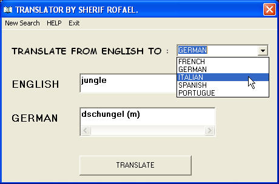



## dictionary from english to other 5 european languages

### Description

translate from english to :

1)french . ( 3257 words )

2)german . ( 9600 words )

3)spanish. ( 7487 words )

4)italian . ( 5160 words )

5)portogue . ( 1375 words )

very simple, very fast , searching from a txt file.
 
### More Info
 

             |
---                |---
**Submitted On**   |1999-02-19 21:29:02
**By**             |[sherif rofael](https://github.com/Planet-Source-Code/PSCIndex/blob/master/ByAuthor/sherif-rofael.md)
**Level**          |Beginner
**User Rating**    |3.2 (29 globes from 9 users)
**Compatibility**  |VB 3\.0, VB 4\.0 \(16\-bit\), VB 4\.0 \(32\-bit\), VB 5\.0, VB 6\.0
**Category**       |[Databases/ Data Access/ DAO/ ADO](https://github.com/Planet-Source-Code/PSCIndex/blob/master/ByCategory/databases-data-access-dao-ado__1-6.md)
**World**          |[Visual Basic](https://github.com/Planet-Source-Code/PSCIndex/blob/master/ByWorld/visual-basic.md)
**Archive File**   |[dictionary1243358292002\.zip](https://github.com/Planet-Source-Code/sherif-rofael-dictionary-from-english-to-other-5-european-languages__1-38473/archive/master.zip)

